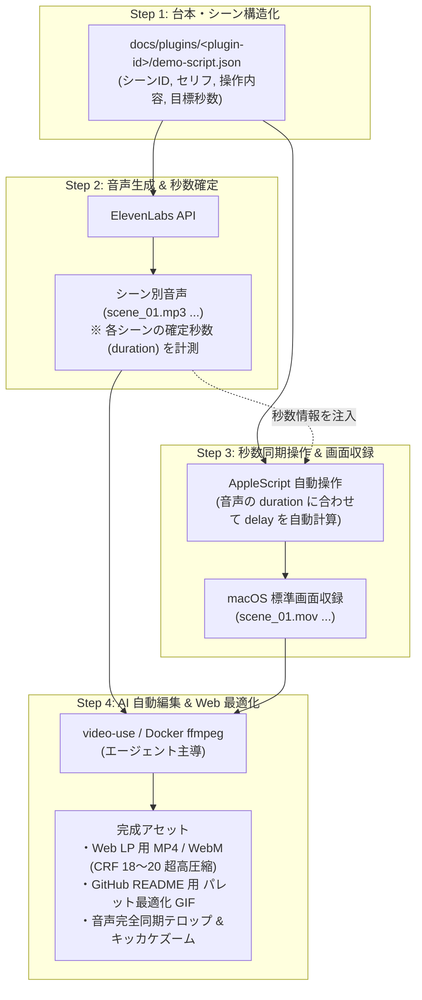

# Generic Video Production Pipeline: Audio-First & Scene-Split Sync
（汎用AI動画制作パイプライン設計書: 音声先行＆シーン分割同期モデル）

## 1. 概要と設計思想 (Overview & Philosophy)

### 目的
本ドキュメントは、Obsidian プラグインをはじめとする各種ソフトウェア、SaaS、開発者ツールのデモ動画・製品紹介動画を、**「完全無料・商用ライセンス安全・最高画質・高再現性」** で制作するための汎用パイプラインを定義します。

### 従来の課題（なぜ動画制作は破綻しやすいのか）
1. **同期崩壊（Sync Drift）**:
   - 画面操作とナレーション音声を別々に収録し、1本の長尺動画として合わせようとすると、わずか 0.5 秒の操作ラグや言い淀みが累積し、後半で映像と音声のタイミングが完全にズレる。
2. **商用ライセンスの罠**:
   - 新興のモダン録画ツール（例: Cap 等）は個人利用無料でも商用利用（プロダクトPR・宣伝・将来の収益化含む）には有料ライセンスが必要なケースがあり、オープンソースや事業展開時の制約となる。
3. **画質劣化とファイル肥大化**:
   - 録画ソフトのリアルタイムエンコードによる文字の滲み（ボケ）、または未圧縮生データの肥大化による Web/GitHub 配信不能（数十MB〜数百MB）。

### 解決アプローチ（コア設計思想）
- **音声先行 (Audio-First)**: 音声（ナレーション）を先に生成して各シーンのミリ秒単位の尺を確定し、その確定秒数に合わせて画面操作の待機時間（`delay`）を制御する。
- **シーン分割同期 (Scene-Split Sync)**: 1本撮りを廃止し、動画を 3〜8 秒のマイクロシーンに分割。シーン単位で映像と音声をバインドして結合することで、ズレの累積を物理的に排除する。
- **完全商用フリー ＆ OS ネイティブ**: 画面収録は macOS 標準機能（Retina等倍の最高峰品質）を採用し、ライセンス制約・外部アプリ依存を排除。
- **AI エージェント自動編集**: 台本策定、操作スクリプト作成、素材結合、テロップ焼き込み、Web 軽量化までをエージェント（Antigravity / Claude Code）と `video-use`（Docker 内 ffmpeg/Remotion）で自動化。

---

## 2. ツールスタックとライセンス選定 (Tool Stack)

| 役割 | 採用ツール | 選定理由・ライセンス |
| :--- | :--- | :--- |
| **画面収録**<br>(Screen Capture) | **macOS 標準機能**<br>(`Cmd + Shift + 5`) | **OS標準（完全無料・商用フリー）**<br>Retina ディスプレイのピクセル等倍記録により、エディタの極小文字も滲みゼロの最高画質マスターフッテージ（MOV）を取得。 |
| **自動操作**<br>(Automation) | **macOS ネイティブ**<br>(AppleScript / `osascript`) | **OS標準（完全無料・商用フリー）**<br>キーボード打鍵・マウス移動・待機（delay）をミリ秒単位で完全に自動化。手ブレや操作ミスを排除。 |
| **音声合成**<br>(Voice Synthesis) | **ElevenLabs API** | **商用利用対応（プロ品質）**<br>感情豊かで自然な多言語（日本語・英語等）ナレーションを一貫したトーンで即座に生成。 |
| **自動編集**<br>(AI Video Editing) | **video-use**<br>+ Docker 内 **ffmpeg** | **オープンソース / 自前完結**<br>AI エージェントが音声と映像をシーン単位でシーケンス結合。自動テロップ、ズーム演出、Web 最適化超高圧縮を一括実行。 |

---

## 3. 4ステップ制作パイプライン (4-Step Pipeline)



---

### Step 1: 台本・シーン構造化定義 (Script Definition)

動画全体を 1 つのテキストにするのではなく、**「3〜8 秒のマイクロシーン」** に分割したデータとして設計します。

#### 推奨シーン構成（標準 20〜30 秒モデル）
1. **Scene 1 (Hook / 課題提起)**: 「〜していませんか？」という現状のペイン（3〜5秒）
2. **Scene 2 (Core Value / 主機能)**: 最も気持ちいいキラー操作の一撃（6〜10秒）
3. **Scene 3 (Advanced / 応用・安心感)**: 逆走・停止・設定などの柔軟性（5〜8秒）
4. **Scene 4 (CTA / 結び)**: ブランド名、ロゴ、インストール導線（3〜5秒）

#### 台本スキーマ仕様（Markdown / JSON）
```json
{
  "title": "Product Demo Showcase",
  "scenes": [
    {
      "id": "scene_01",
      "name": "Hook",
      "audio_text": "Obsidianでノートを読むとき、いちいちサイドバーをクリックしていませんか？",
      "visual_action": "ノート末尾までスクロールして行き止まりになる様子",
      "target_duration_sec": 4.5
    },
    {
      "id": "scene_02",
      "name": "Core Flow",
      "audio_text": "Page Flowなら、スペースキーを叩くだけ。流れるように次のファイルへ滑空します。",
      "visual_action": "Spaceキー打鍵でノート末尾から次のノートへ高速トランジション",
      "target_duration_sec": 7.0
    }
  ]
}
```

---

### Step 2: 音声生成 ＆ 秒数確定 (Audio-First Lock)

ElevenLabs（[elevenlabs.io](https://elevenlabs.io/)）を使用して、シーンごとのナレーション音声を書き出します。  
無料プラン（Free Tier）で毎月 10,000 文字（約 10〜15 分分の音声）が利用でき、一般的な 20〜30 秒のデモ動画（約 100 文字）であれば完全無料で制作可能です。

#### 方法 A: Web ダッシュボードで生成（推奨・声色の試聴が容易）
1. **ログイン ＆ 画面移動**:
   - [elevenlabs.io](https://elevenlabs.io/) にログインし、左メニューの **「Speech」**（Text to Speech）を開く。
2. **モデルの選択**:
   - Model ドロップダウンから **`Eleven Multilingual v2`** を選択（日本語・英語のイントネーション・自然さが最高峰のモデル）。
3. **ボイス（声色）の選定**:
   - 声の一覧からプレビューを聴き、プロダクトのトーンに合った声を選択。
   - *おすすめボイス例*:
     - `Adam`: 落ち着いた低音（信頼感のあるテック系ナレーション）
     - `Rachel`: 明るく明瞭なトーン（親しみやすい解説・チュートリアル）
     - `George`: 知的で温かみのあるトーン（本格的な機能解説）
4. **生成 ＆ ダウンロード**:
   - Step 1 で定義したシーンごとの原稿（`audio_text`）を入力し、**「Generate speech」** をクリック。
   - 生成結果を試聴し、問題なければ右下の **「↓（Download）」** から MP3 を保存。
5. **配置**:
   - プロジェクト内の `assets/audio/<plugin-id>/` ディレクトリに、シーンID命名（例: `scene_01.mp3`, `scene_02.mp3`）で配置。

#### 方法 B: API / エージェントによる自動生成
API キーを使用し、エージェントやスクリプトから自動一括生成することも可能です。

1. **API キーの取得と設定**:
   - ElevenLabs 画面左下の「Profile Icon」→「API Keys」よりキーを発行。
   - リポジトリのテンプレートをコピーし、`.env.local` にキーを設定（`.env*.local` は `.gitignore` に登録済み）：
     ```bash
     cp .env.example .env.local
     ```
2. **API コール例**:
   ```bash
   curl -X POST "https://api.elevenlabs.io/v1/text-to-speech/{VOICE_ID}" \
     -H "xi-api-key: {YOUR_API_KEY}" \
     -H "Content-Type: application/json" \
     -d '{
       "text": "Obsidianでノートを読むとき、いちいちサイドバーをクリックしていませんか？",
       "model_id": "eleven_multilingual_v2",
       "voice_settings": {
         "stability": 0.5,
         "similarity_boost": 0.75
       }
     }' \
     --output assets/audio/<plugin-id>/scene_01.mp3
   ```

#### 秒数（Duration）の正確な計測
生成された音声ファイルの再生時間（秒数）を Docker コンテナ内の `ffprobe` で計測し、Step 3 の操作待機時間として確定させます。

```bash
# Docker コンテナ内でミリ秒単位の尺を取得
docker compose run --rm obsidian-plugins-portal \
  ffprobe -v error -show_entries format=duration -of default=noprint_wrappers=1:nokey=1 assets/audio/<plugin-id>/scene_01.mp3

# 出力例: 4.238125 -> 4.2秒 (操作スクリプトの delay 計算基準として固定)
```

---

### Step 3: 秒数同期操作 ＆ 画面収録 (Synced Capture)

確定した音声の尺（例: 4.2秒）を AppleScript の `delay` に厳密に反映させます。

#### AppleScript テンプレート例
```applescript
-- 音声の長さ (4.2秒) に合わせた操作シナリオ
tell application "Obsidian" to activate
delay 0.5

-- アクション開始 (Space キー連打)
tell application "System Events"
    -- 1回目のスクロール
    key code 49
    delay 1.5
    
    -- ノート境界を越えて次ノートへ滑空
    key code 49
    delay 2.0
end tell

-- 残り時間バッファ
delay 0.2
```

#### 収録のベストプラクティス
- **解像度**: ウィンドウサイズを固定（例: 1280x800 または 1920x1080）してアスペクト比 16:10 / 16:9 を維持。
- **ウィンドウ録画**: `Cmd + Shift + 5` の「選択したウィンドウを収録」を使用し、余計なデスクトップ背景を写さない。
- **外観**: プロダクトの美しさが際立つダークテーマ推奨、フォントサイズはやや大きめ（16〜18px）に設定。

---

### Step 4: AI 自動編集 ＆ Web 最適化 (Assembly & Optimization)

エージェントが `video-use` および Docker 内 `ffmpeg` を起動して自動処理します。

1. **シーン結合とリップシンク**:
   - `scene_01.mov` + `scene_01.mp3` を結合。
   - シーン間に 0.2 秒のクロスフェードまたはスマートカットを適用。
2. **自動テロップ生成**:
   - 音声波形から Whisper 等でタイムスタンプ付き字幕（SRT/VTT）を抽出し、モダンな角丸バッジスタイルで画面下部に焼き込み。
3. **キー入力バッジ / ズーム演出**:
   - Space 打鍵タイミングに合わせて画面端に「⎵ Space」HUD を表示、重要な UI 要素へ滑らかにパン/ズーム。
4. **マルチフォーマット超高圧縮書き出し**:
   - **LP ヒーロー用（MP4 / WebM）**:
     ```bash
     ffmpeg -i master.mov -c:v libx264 -crf 19 -preset slow -pix_fmt yuv420p -an web_demo.mp4
     ```
     *見た目の画質劣化ゼロでファイルサイズを 1/15 以下（2〜4MB 程度）に圧縮。*
   - **GitHub README 用（パレット最適化 GIF）**:
     ```bash
     ffmpeg -i master.mov -vf "fps=20,scale=800:-1:flags=lanczos,split[s0][s1];[s0]palettegen[p];[s1][p]paletteuse" readme_demo.gif
     ```
     *色潰れ・ディザリングノイズを抑えた高品質軽量 GIF を生成。*

---

## 4. 他プロダクトへの横展開チェックリスト (Playbook Checklist)

新規ツールやプラグインの動画を作成する際は、以下のチェックリスト順に実行します。

- [ ] **1. 台本の作成**: 4 シーン（Hook, Core, Advanced, CTA）のセリフと画面アクションを `docs/plugins/<plugin-id>/demo-script.md` で定義。
- [ ] **2. 音声の生成**: ElevenLabs 等で各シーンの音声を生成（`assets/audio/<plugin-id>/`）し、`ffprobe` でミリ秒単位の尺を記録。
- [ ] **3. 操作スクリプトの作成**: 記録した秒数を `delay` に反映した AppleScript を `scripts/demo/plugins/<plugin-id>/demo.applescript` に生成。
- [ ] **4. 画面収録**: `./scripts/demo/run.sh <plugin-id> full --record` で操作を実行・自動収録（`raw_recordings/<plugin-id>/` に保存）。
- [ ] **5. 自動編集と圧縮**: `video-use` / `ffmpeg` で結合、テロップ付与、Web用（MP4/WebM）とREADME用（GIF）を出力。
- [ ] **6. リポジトリ配置**: LP コンポーネントおよび README の該当箇所に埋め込み。
